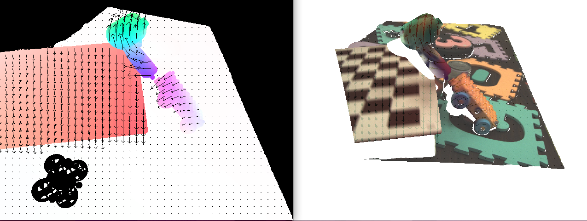

# Ground Truth flow for EVIMO2

A tool is provided to calculate optical flow from the generated datasets. The source code for the tool is [here](https://github.com/better-flow/evimo/blob/master/tools/evimo_flow.py)

The output is equivalent to the [MSEVC](https://daniilidis-group.github.io/mvsec/) flow format.

Example usage:

```bash
evimo_flow.py [-h] [--dt DT] [--quiet] [--overwrite] [--wait] [--dframes DFRAMES] [files ...]
```
## Notes

Because EVIMO2 does not have depth for background pixels, missing flow values are set to NaN.

The flow frame timestamps can skip when Vicon has lost track and ground truth depth is no longer available.

Example Image:


## Options
The tool accepts the following flags.

|Flat |Description |
------------ | --- |
|`-h, --help`| Show this help message and exit|
|`--dt DT `| dt for flow approximation<br> "dt" is how far ahead of the camera trajectory to sample in seconds <br> when approximating flow through finite difference. Smaller values<br> are more accurate, but noiser approximations of optical flow<br> The flow velocity is obtained from dx,dy/dt, where dx,dy are written<br> to the flow output files|
|`--quiet`| Turns off OpenCV graphical output windows|
|`--overwrite`| Overwrite existing output files|
|`--wait`| Wait for keypress between visualizations (for debugging)|
|`--dframes DFRAMES`| Alternative to flow_dt, flow is calculated for time N depth frames ahead<br> Useful because the resulting displacement arrows point to the new position<br> of points in the scene at the time of a ground truth frame in the future|
|`--format FORMAT`| "evimo2v1" or "evimo2v2" input data format|
