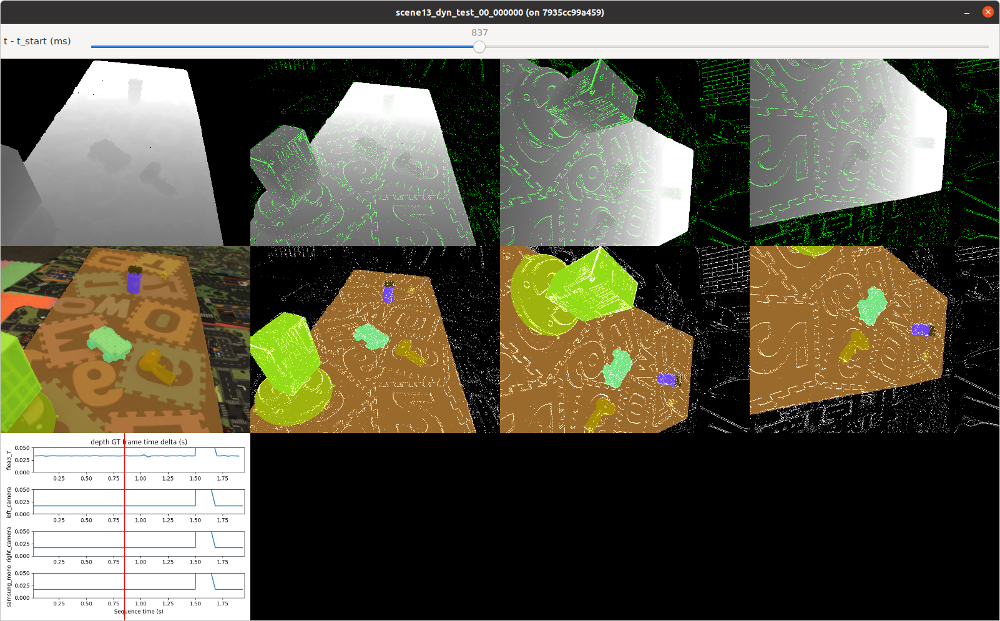

# Inspecting an EVIMO2 v2 Sequence

An interactive visualizer is provided for quickly looking through an EVIMO2 v2 sequence in the NPZ format. A slider can be moved around to inspect all cameras in a sequence with millisecond precision.

Example usage:

```bash
./tools/evimo2_v2_inspect/view_sequence_all_cameras.py --idir ~/EVIMO/npz --seq scene13_dyn_test_00_000000
```

Example Image:

