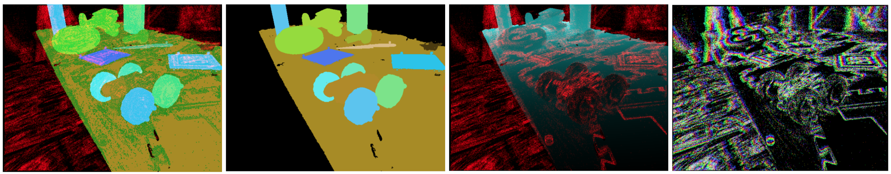
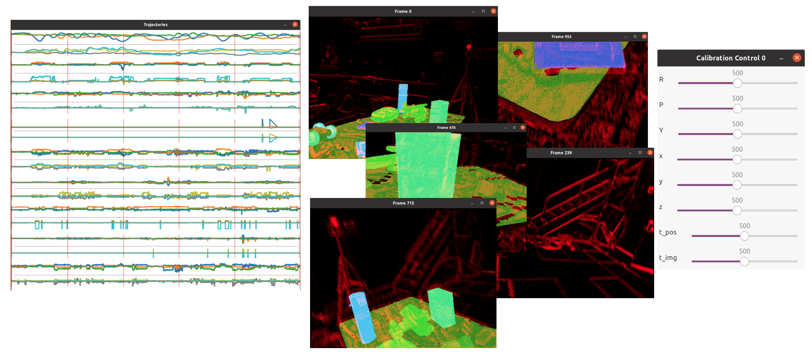

# Raw Sequence Inspection

This page describes how to use the **offline tool** for visualization of a raw recording's [sequence folder](raw-sequence-structure.md). How to launch, and what parameters the offline tool accepts, is described in the [offline generation tool page](offline-generation-tool.md).

## Visualization modes
Two kinds of visualization are currently supported: 

### `_show:=-2`

A frame-by-frame visualization (with a scroll bar to go through the dataset frames). Rendering modes can be changed by pressing keys 1-4.

The visualization code is [here](https://github.com/better-flow/evimo/blob/67bc579e0588f8acd9d2cb37eb85cd5ddac8b6ef/evimo/offline.cpp#L126).

From left to right (keys 1-4): mask with events overlaid, mask, depth with events overlaid, events color-coded by their timestamp.

### `_show:=<any positive integer>` 

A multi-frame visualization. The sequence cannot be scrolled through, however multiple frames can be seen at once, the trajectory plots are shown, and the manual calibration window is made available.

**Note:** the rotation component in trajectories is plotted in Euler angles, and angles can 'roll over' from *-pi* to *pi* during the full turn.

The visualization code is [here](https://github.com/better-flow/evimo/blob/67bc579e0588f8acd9d2cb37eb85cd5ddac8b6ef/evimo/dataset_frame.h#L82).

From left to right: Trajectory plot with red vertical lines at the timestamps of rendered frames. Visualized frames at the times of the red vertical lines. Manual calibration window.

## Keyboard Shortcuts
Relevant ([code](https://github.com/better-flow/evimo/blob/67bc579e0588f8acd9d2cb37eb85cd5ddac8b6ef/evimo/dataset.h#L196))

|Key |Description |
|--- | --- |
|`'esc'`| Exit the application|
|`'1'`| Display mask, events or mask, and rgb image|
|`'2'`| Display mask|
|`'3'`| Display depth and events (without rgb overlay)|
|`'4'`| Display events color coded by the timestamp position with a slice|
|`'space'`| Switch to next rendering mode (1/2/3/4)|
|`'['`| Decrease event slice width|
|`']'`| Increase event slice width|
|`'o'`| (experimental) Increase window for Vicon pose smoothing (default 0)|
|`'p'`| (experimental) Decrease window for Vicon pose smoothing (default 0)|
|`'c'`| Reset extrinsic calibration sliders to mid value (sliders only available in multi-frame mode)|
|`'s'`| Write the calibration (extrinsic or time offset) to the [sequence's camera folder](raw-sequence-structure.md)|
|`'''`| (frame-by-frame mode only) Move one frame forward|
|`';'`| (frame-by-frame mode only) Move one frame backward|
|`'c'`| (frame-by-frame mode only) Render a 3d pointcloud (experimental, [additional controls](https://github.com/better-flow/evimo/blob/67bc579e0588f8acd9d2cb37eb85cd5ddac8b6ef/evimo/annotation_backprojector.h#L661))|

